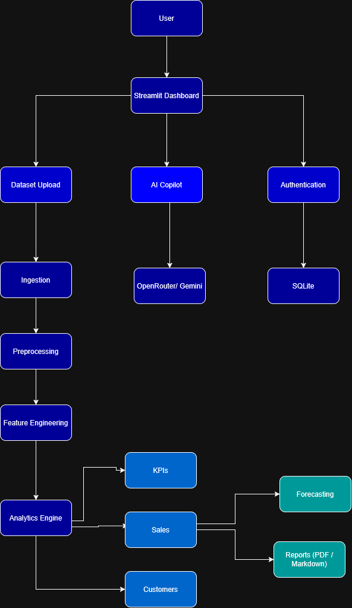
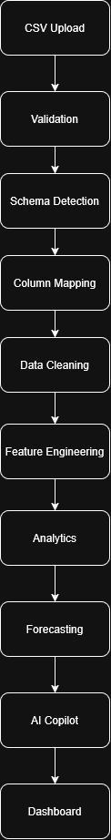
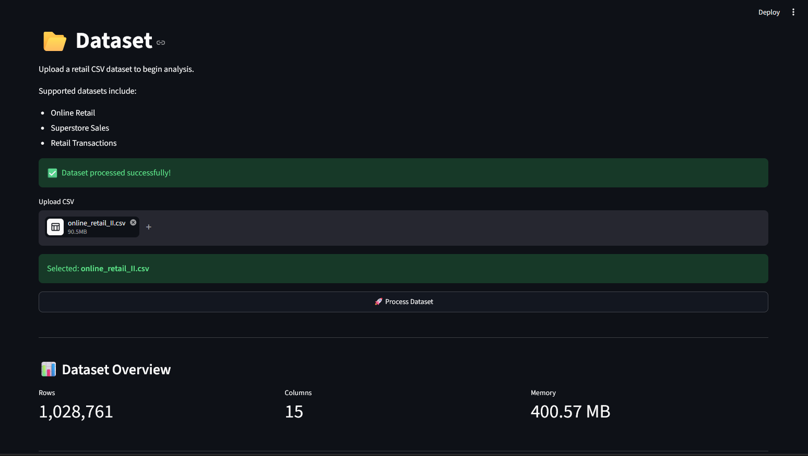
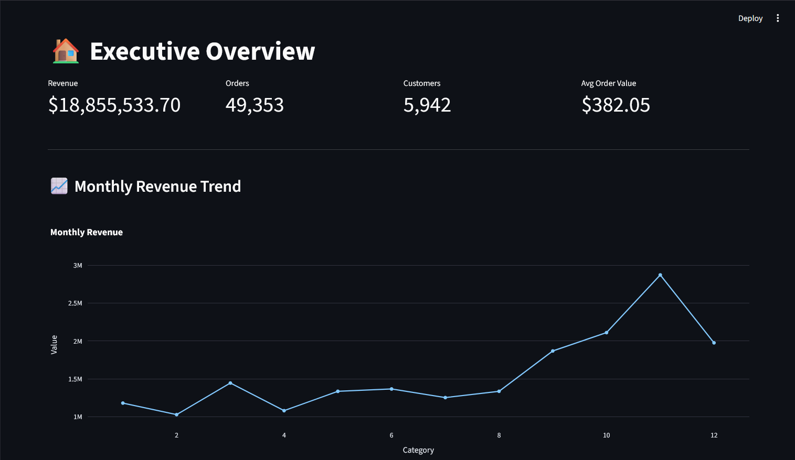
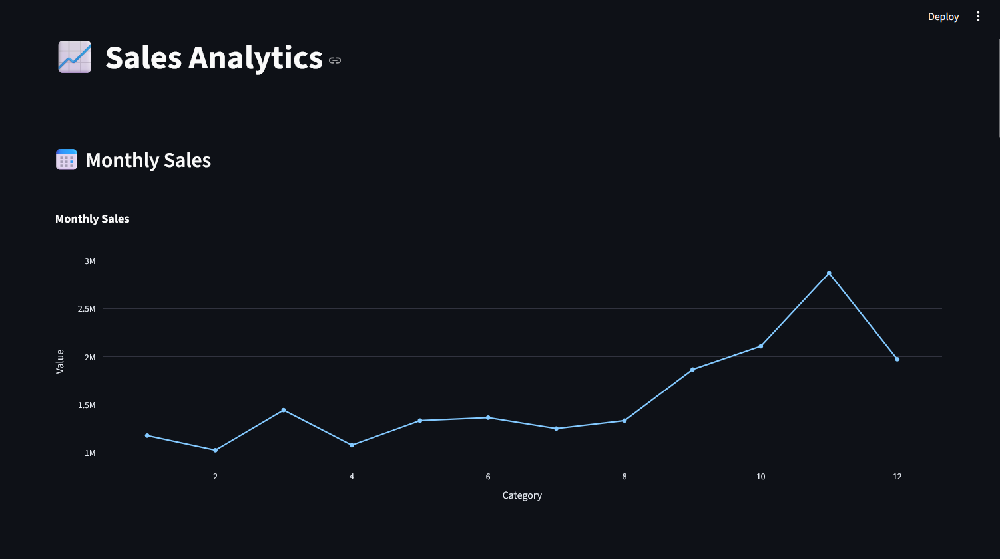
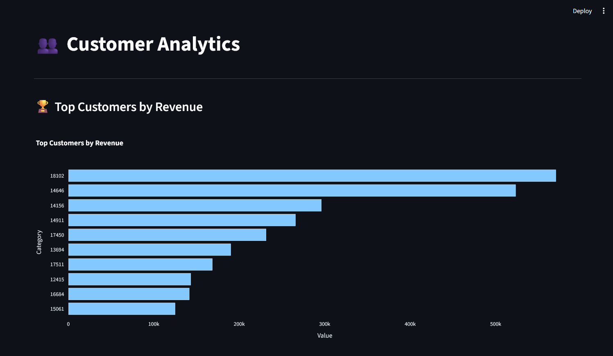
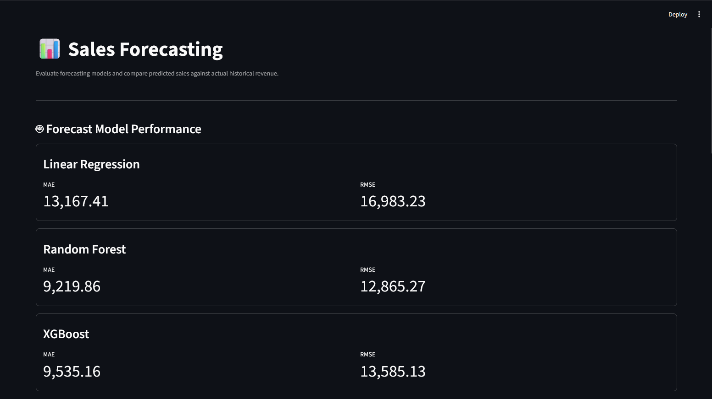
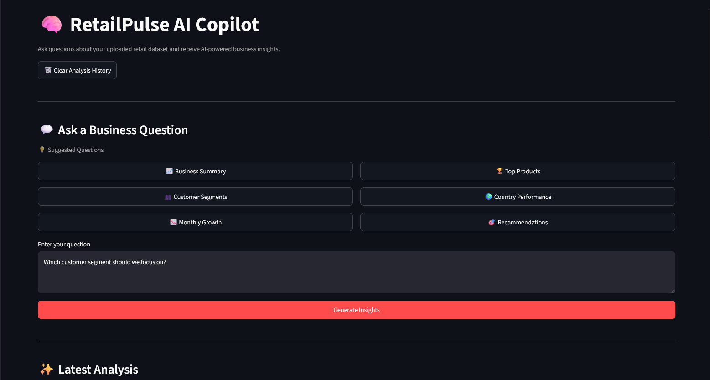

<div align="center">

# 📊 RetailPulse AI

### AI-Powered Retail Analytics & Decision Intelligence Platform

Transform raw retail transaction data into interactive dashboards, sales forecasts, customer insights, and AI-powered business recommendations.

[]()
[]()
[]()
[]()
[]()

</div>

---

## 📖 Overview

RetailPulse AI is an end-to-end retail analytics platform that automates the complete analytics workflow—from raw CSV data to business intelligence dashboards, machine learning forecasts, and AI-generated insights.

It combines **Data Engineering**, **Business Intelligence**, **Machine Learning**, and **Generative AI** into a single application for retail decision-making.

---
## Live Demo 
  https://retailpulse-ai-jlrw7ozjaepfihtpabcfxw.streamlit.app/
---

## ✨ Features

### 📂 Data Processing

- CSV Dataset Upload
- Automatic Schema Detection
- Intelligent Column Mapping
- Data Validation
- Data Cleaning
- Feature Engineering

### 📊 Analytics

- Executive KPI Dashboard
- Sales Analytics
- Customer Analytics (RFM)
- Country-wise Revenue Analysis
- Product Performance Analysis
- Monthly Growth Analysis

### 🔮 Forecasting

- Sales Forecasting
- Actual vs Predicted Comparison
- MAE & RMSE Evaluation

### 🧠 AI Copilot

- Natural Language Business Queries
- Executive Summaries
- Business Recommendations
- PDF Report Export
- Markdown Report Export

### 🔐 Authentication

- User Registration & Login
- Secure Session Management
- Protected Dashboard

---

# 🏗️ System Architecture

<p align="center">

</p>

# 🚀 Application Workflow

<p align="center">

</p>

## 🛠️ Tech Stack

| Category | Technologies |
|----------|--------------|
| Language | Python |
| Dashboard | Streamlit |
| Data Analysis | Pandas, NumPy |
| Visualization | Plotly |
| Machine Learning | Scikit-learn |
| AI | OpenRouter, Google Gemini |
| Database | SQLite |
| Reports | PDF, Markdown |
| Version Control | Git, GitHub |

---
# 📸 Dashboard Preview

## 📂 Dataset

<p align="center">

</p>

---

## 🏠 Overview

<p align="center">

</p>

---

## 📈 Sales Analytics

<p align="center">

</p>

---

## 👥 Customer Analytics

<p align="center">

</p>

---

## 📊 Forecasting

<p align="center">

</p>

---

## 🧠 AI Copilot

<p align="center">

</p>

# 📁 Project Structure

```text
RetailPulse-AI/
│
├── app/
│   ├── ai/
│   ├── analytics/
│   ├── auth/
│   ├── config/
│   ├── dashboard/
│   ├── forecasting/
│   ├── ingestion/
│   ├── preprocessing/
│   └── pipeline.py
│
├── assets/
│   ├── screenshots/
│   └── diagrams/
│
├── data/
│   └── raw/
│
├── requirements.txt
├── README.md
└── main.py
```

---

# ⚙️ Installation

## 1️⃣ Clone the Repository

```bash
git clone https://github.com/codewithnihar2027/RetailPulse-AI.git

cd RetailPulse-AI
```

---

## 2️⃣ Create Virtual Environment

### Windows

```bash
python -m venv venv

venv\Scripts\activate
```

### Linux / macOS

```bash
python3 -m venv venv

source venv/bin/activate
```

---

## 3️⃣ Install Dependencies

```bash
pip install -r requirements.txt
```

---

## 4️⃣ Configure Environment Variables

Create a `.env` file.

```env
LLM_PROVIDER=openrouter

OPENROUTER_API_KEY=YOUR_API_KEY

OPENROUTER_MODEL=google/gemma-4-26b-a4b-it:free

GEMINI_API_KEY=YOUR_API_KEY

GEMINI_MODEL=gemini-2.0-flash
```

---

## ▶️ Run the Application

```bash
streamlit run app/dashboard/main.py
```

Open your browser:

```
http://localhost:8501
```

---

# 📂 Supported Dataset

RetailPulse AI is designed for retail transaction datasets.

Example schema:

| Column | Description |
|---------|-------------|
| Invoice | Invoice Number |
| InvoiceDate | Transaction Date |
| Product | Product Description |
| Quantity | Units Sold |
| Price | Unit Price |
| CustomerID | Customer Identifier |
| Country | Customer Country |

The application automatically validates, maps, and standardizes supported retail datasets before analysis.

---

# 🤖 AI Copilot Examples

RetailPulse AI supports natural language business analysis.

### Example Questions

```
Summarize my business performance.
```

```
Which products generate the highest revenue?
```

```
Which customer segment should we focus on?
```

```
Why did revenue decrease in February?
```

```
Which country contributes the most revenue?
```

```
What actions should I take next month?
```

---

# 📊 Dashboard Modules

| Module | Description |
|---------|-------------|
| 📂 Dataset | Upload and process retail datasets |
| 🏠 Overview | Executive KPIs and revenue trends |
| 📈 Sales Analytics | Product and sales performance |
| 👥 Customer Analytics | RFM segmentation and customer insights |
| 🔮 Forecasting | Machine Learning based sales prediction |
| 🧠 AI Copilot | Natural language business intelligence |

---

# 📈 Analytics Generated

RetailPulse AI automatically computes:

- Revenue KPIs
- Monthly Revenue
- Weekly Revenue
- Quarterly Revenue
- Monthly Growth
- Country-wise Sales
- Product Revenue
- Product Quantity
- Customer Revenue
- Customer Orders
- RFM Customer Segmentation
- Sales Summary
- Daily Summary
- Average Daily Revenue

---

# 📄 AI Report Generation

The AI Copilot can generate professional business reports in multiple formats.

Supported exports:

- 📄 PDF Report
- 📝 Markdown Report

Each report includes:

- Executive Summary
- Key Findings
- Business Recommendations

---

# 🔒 Authentication

RetailPulse AI includes a built-in authentication system featuring:

- User Registration
- Secure Login
- Session Management
- Protected Dashboard Access
- Logout Functionality

---

# 🚀 Future Roadmap

The following features are planned for future releases:

- Explainable AI using SHAP
- Customer Churn Prediction
- Advanced Time-Series Forecasting (XGBoost / LSTM / Prophet)
- Multi-Dataset Support
- REST API Integration
- Docker Deployment
- Cloud Deployment
- Role-Based Access Control (RBAC)

---

# 🌟 Why RetailPulse AI?

RetailPulse AI is more than a dashboard—it demonstrates the complete lifecycle of a real-world data product.

It showcases practical experience in:

- Data Engineering
- Data Cleaning & Feature Engineering
- Business Intelligence
- Machine Learning
- Forecasting
- Large Language Model (LLM) Integration
- Dashboard Development
- Software Architecture
- Authentication & Session Management

---

# 💡 Key Highlights

- ✅ End-to-End Retail Analytics Platform
- ✅ Automated Data Processing Pipeline
- ✅ Interactive Business Intelligence Dashboard
- ✅ RFM Customer Segmentation
- ✅ Machine Learning Forecasting
- ✅ AI-powered Business Copilot
- ✅ PDF & Markdown Report Generation
- ✅ Modular and Scalable Architecture
- ✅ Clean & Professional User Interface

---

# 🤝 Contributing

Contributions, suggestions, and feature requests are welcome.

If you'd like to improve RetailPulse AI:

1. Fork the repository
2. Create a new feature branch
3. Commit your changes
4. Open a Pull Request

---

# 📜 License

This project is licensed under the **MIT License**.

See the `LICENSE` file for details.

---

# 👨‍💻 Author

**Nihar Suman**

- 🎓 B.Tech CSE (AI & ML)
- 💼 Aspiring AI/ML Engineer & Data Scientist

### GitHub

https://github.com/codewithnihar2027

---

## ⭐ Support

If you found this project useful, consider giving it a ⭐ on GitHub.

It helps others discover the project and motivates future development.

---

<div align="center">

### ⭐ Thank you for visiting RetailPulse AI ⭐

**Built with Python, Machine Learning, Business Intelligence, and Generative AI**

</div>
